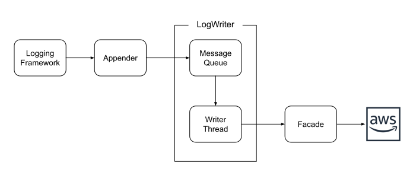

# Implementation Notes

This library is heavily object-oriented. I'm not going to say it's "good" OO, because Dunning-Kruger.
However, the basic architecture has worked very well over the past several years, and was extensible
to three different logging frameworks and two underlying AWS SDKs without pain, so I don't think it's
"bad" OO.

That said, there are a lot of classes, heavy use of inheritance, helpers and factories, and patterns
galore. If you have a philosophical opposition to any of that, you should probably stop reading.

This document exists as an introduction to the major parts of the library and implementation
techniques. Its primary goal is to orient me when I return to the codebase after six months, so
does not dive too deeply into any of the topics (ie, if you really want to know how things work,
you'll need to read code).

# Data Flow Diagram

## Abstract Classes

Every logging framework does the same thing: it configures an appender and calls `append()`
on it. Every log-writer does the same thing: it builds a batch of messages from the message
queue and then sends it to the destination. This is, in my opinion, a perfect place for an
abstract class or two:

* `AbstractAppender`

  Handles the common appender tasks: initialization, `append()`, and shutdown. It also handles
  configuration that is supported by every appender: batch delay, client endpoints, and so on.
  There isn't anything for the subclasses to handle other than destination-specific configuration.

  Note that there's no abstraction across logging frameworks: the framework typically requires
  that appenders subclass a framework-specific base class. It would be nice if Java supported
  mixins, so that configuration could be extracted, but even in that case Log4J2 would throw
  a wrench into the works.

* `AbstractLogWriter`

  This class handles the writer life-cycle and batch-building. It invokes subclass methods to
  check message size, determine how large a batch should be, ensure that the destination exists,
  and send a batch to that destination.

There are several other uses of abstract classes, ranging from client configuration to integration
tests. You'll find most of them in the `internal` packages.

## Facades

This is the big change for the 3.0 release: to support old and new AWS SDKs (which changed
class, package, and method names, but _not_ the underlying API), the log-writers now interact
with a facade class rather than the SDK.

There are currently four facade classes: `CloudWatchFacade`, `KinesisFacade`, `SNSFacade`,
and `InfoFacade`. The first three are thin wrappers around the corresponding service API;
all logic for retries and exceptional conditions is in the corresponding log-writer. The
fourth is intended to provide information about the deployment environment in a "best
effort" manner; the appenders do not depend on its operation.

All facades are instantiated via `FacadeFactory.createFacade()`, a static method that uses
reflection to determine which implementation library is linked into the application (and
which throws if none is). Since this is a static method, it can be called from any point
in the codebase (and this is leveraged by [substitutions](substitutions.md) to access the
`InfoFacade`).

The "service" facades all take an object that contains appender configuration. They use
this object to (1) figure out how to [create the service client](client.md), and (2) to
provide information such as log group/stream name to the SDK.

As noted above, the various log-writers are responsible for all logic (such as retries)
when interacting with the service; the facade is a thin wrapper that translates
SDK-specific classes into something else. In most cases, this something else is a
service-specific facade exception (eg, `CloudWatchFacadeException`); the log-writer
interprets the exception's "reason code" to decide whether the failure is something
important. In the case of describe operations, the "something else" is `null` to signify
that the thing being described doesn't exist.

I went back and forth several times on how heavyweight the facades should be. In the end,
I decided based on limiting the amount of code that would have to be duplicated to support
the v2 SDK. I think this also improved the layerability and testability of the framework.

## Locking

The logging framework may or may not synchronize calls to the appender. Log4J1, for
example, uses one large synchronized block to call all appenders, while Log4J2 assumes
they'll synchronize themselves.

The appenders don't do any explicitly synchronization of the `append()` call. Instead,
they perform as much work as they can in a thread-safe manner, and then put the message
on a concurrent queue for consumption by the log writer.

The one thing that is explicitly synchronized within this library is writer creation
and shutdown, using the `initializationLock` variable. I think this may be a "belt and
suspenders" protection for Logback and Log4J2, because the library is responsible for
initializing the appender (and, one presumes, is smart enough to only do that once).
And even Log4J1, with lazily initialization, shouldn't need this protection because
of the framework's synchronization. However, leaving it in place is a low-pain way to
ensure that we don't have hard-to-diagnose issues.

## Log4J1 Initialization

Unlike Logback and Log4J2, Log4J1 does not have an appender life-cycle. This means that
the Log4J1 appenders must be initialized by the first call to `append()`. As a result,
many unit tests include a single dummy log message to trigger initialization.

In practice this means that you won't discover logging configuration problems until the
first time that you try to use a logger, which may be some time after your application
starts. As a work-around -- and a generally good practice -- log an "I'm here!" message
at the start of your `main` method.
