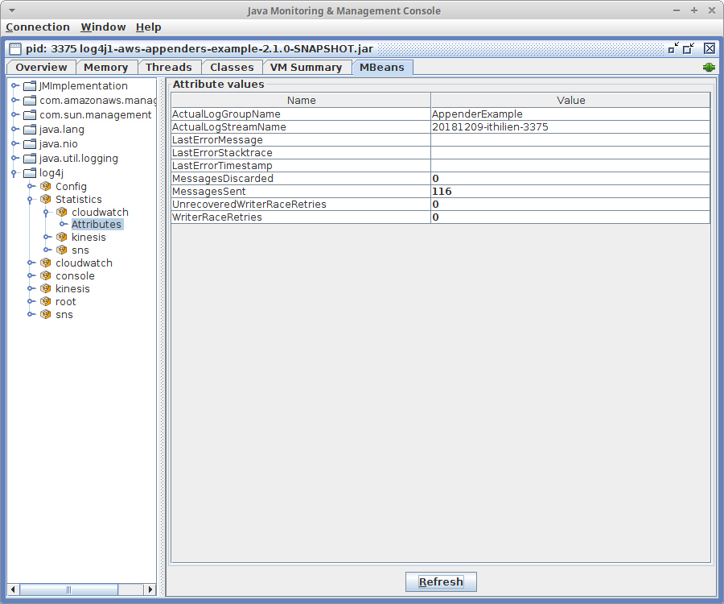

# JMX Support

The appenders will optionally register JMX "statistics beans" with one or more MBeanServers.
These beans provide the following information:

* The post-substitution name of the destination (stream/topic).
* The number of messages that have been successfully sent to the destination.
* The number of messages that have been discarded due to inability to send.
* The most recent error (initialization or runtime), with timestamp and stacktrace.




## Enabling

To enable JMX reporting you must register an instance of `com.kdgregory.log4j.aws.StatisticsMBean`
with one or more MBeanServers. At the same time, you will probably want to register Log4J's
`HierarchyDynamicMBean` so that you can examine and update your application's loggers.

```
ManagementFactory.getPlatformMBeanServer().createMBean(
        HierarchyDynamicMBean.class.getName(),
        new ObjectName("log4j:name=Config"));

ManagementFactory.getPlatformMBeanServer().createMBean(
        StatisticsMBean.class.getName(),
        new ObjectName("log4j:name=Statistics"));
```

The `ObjectName` that you use to register these beans can be anything. The statistics beans will
base their own name on the object name used for `StatisticsMBean`, but the Log4J beans will always
use the `log4j` domain. I find it easier, as here, to use the `log4j` namespace in order to keep
the statistics and configuration together.

> Note: this represents a change from version 1.0 of the appenders, which would also ignore the
  namespace used to register `StatisticsMBean` and instead pick a name that organized the
  statistics beans under the Log4J-managed beans.

The example program, as a stand-alone application, uses the JVM's platform MBeanServer. Depending on
the framework that your application uses, you may want to register with a framework-supplied server
(for example, Spring provides its own server and expects you to
[register your JMX beans](https://docs.spring.io/spring/docs/current/spring-framework-reference/integration.html#jmx)
with the rest of your beans).

If your application explicitly unregisters the `StatisticsMBean`, then the appenders will unregister
themselves from the same server(s). The appenders will also unregister themselves when closed. Normally
you'd never do this: appenders only get closed when the application shuts down or is unloaded.


## Classpath Isolation

Internally, the appenders library maintains the associations between StatisticMBeans, appender MBeans,
and MBeanServers in statically-referenced data structures. This is necessary to avoid the inevitable
race conditions between appender creation and `StatisticMBean` registration without creating explicit
links between them.

To avoid strange JMX behavior -- for example, beans registered under one web-app but not another
running in the same server -- you should load the appenders library in the same classloader as Log4J.
You should do this anyway, to avoid Log4J configuration errors.

## Data Available

Note: the authoritative documentation for each value is maintained as JavaDoc in the MXBean interfaces.
This document provides supplemental information.

All log writers support the following attributes:

* `MessagesSent`: The number of messages successfully written to the destination.
* `LastErrorMessage`: The last error message generated by the writer, if any. This
  normally contains an exception name and message, but may be a more generic error
  such as "initialization failure", and may not have an associated exception.
* `LastErrorTimestamp`: The time that the last writer error occurred, if any.
* `LastErrorStacktrace`: The stacktrace from the last writer error, if it involved
  an exception.

`CloudWatchLogWriter` provides the following additional attributes, defined by
[CloudWatchWriterStatisticsMXBean](../aws-shared/src/main/java/com/kdgregory/logging/aws/cloudwatch/CloudWatchWriterStatisticsMXBean.java):

* `ActualLogGroupName`: The actual destination log group name, after subsitutions
  have been applied to the configured name.
* `ActualLogStreamName`: The actual destination log stream name, after subsitutions
  have been applied to the configured name.
* `MessagesDiscardedByCurrentWriter`: The number of messages that have been discarded
  by the current writer due to queue backlog. Note that this is reset on writer rotation,
  unlike the `MessagesDiscarded` statistic of other writers.
* `WriterRaceRetries`: The number of batches that retried due to `InvalidSequenceTokenException`.
  This exception indicates a race condition between two writers: they each receive the
  same sequence token, but only one of them can use it to store log events. This can happen
  when batch delays are very low and/or there are a large number of writers that start at
  approximately the same time.

`KinesisLogWriter` provides the following additional attributes, defined by
[KinesisWriterStatisticsMXBean](../aws-shared/src/main/java/com/kdgregory/logging/aws/kinesis/KinesisWriterStatisticsMXBean.java).

* `ActualStreamName`: The actual destination stream name, after subsitutions have been
  applied to the configured name.
* `MessagesDiscarded`: The number of messages that have been discarded by the writer due
  to queue backlog.

`SNSLogWriter` provides the following additional attributes, defined by
[SNSWriterStatisticsMXBean](../aws-shared/src/main/java/com/kdgregory/logging/aws/sns/SNSWriterStatisticsMXBean.java).

* `ActualTopicName`: The actual destination topic name, after subsitutions have been
  applied to the configured name.
* `ActualTopicArn`: The actual destination topic ARN, either looked up from the actual
  topic name, or after subsitutions have been applied to the configured ARN.
* `MessagesDiscarded`: The number of messages that have been discarded by the writer due
  to queue backlog.
